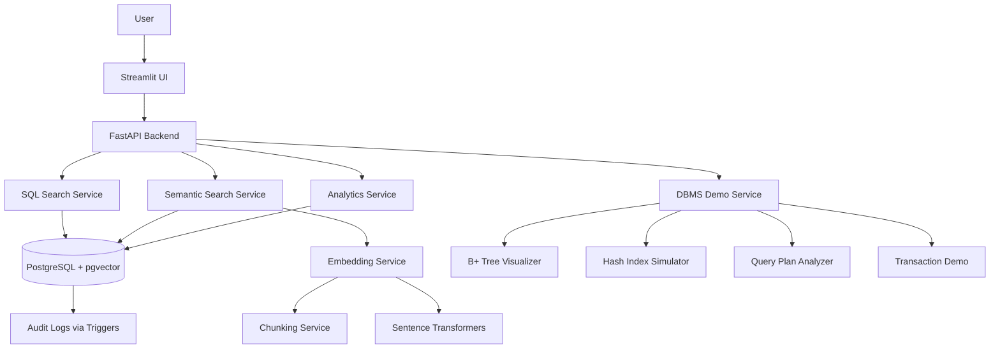

# CourseDB-AI: A 12-Week Learning Journey

**Relational Database + Vector Search System for Semantic Academic Resource Retrieval**

---

## 🎯 Project Overview

**CourseDB-AI** is a DBMS-centered AI search system that stores academic course resources, previous-year questions, textbook chapters, topics, and metadata in a normalized relational database, then adds semantic search using embeddings and vector similarity.

This is NOT a code dump. This is a **12-week self-study learning repository** where I progressively learn DBMS concepts, experiment, break things, rebuild, and gradually construct the CourseDB-AI system from the ground up.

---

## 🤔 Why I Built This

I am a 2nd-year Computer Science student studying **Database Management Systems** in university. My long-term career goal is **AI Engineering / Machine Learning Engineering / MLOps**.

I wanted to:
- **Use my university DBMS course as a practical foundation** for my portfolio
- **Deeply understand** database systems, not just use AI to generate code
- **Connect traditional DBMS concepts** (normalization, indexing, transactions) to **modern AI infrastructure** (embeddings, vector search, semantic retrieval)
- **Build something real** that demonstrates both database design skills and AI engineering thinking
- **Learn by doing**: theory → exercises → implementation → debugging → testing → reflection

---

## 🎓 Problem Statement

**The Problem:**
Students and instructors struggle to retrieve relevant academic resources (previous-year questions, notes, textbook chapters) using only keyword search. Questions are often mislabeled or difficult to find based on topics, year, or difficulty.

**The Solution:**
CourseDB-AI combines:
1. **Structured relational database** (normalized schema, constraints, triggers, indexes)
2. **SQL-based filtering** (by year, topic, difficulty, resource type)
3. **Semantic vector search** (using embeddings and cosine similarity)
4. **Analytics** (topic frequency, year-wise trends)
5. **DBMS internals demonstrations** (B+ tree, hashing, query plans, transactions)

---

## ✨ Final System Features

- **Store academic resources**: courses, topics, questions, resources, chapters, tags
- **Normalized relational schema**: proper ER design, 3NF/BCNF
- **SQL search**: filter by difficulty, year, topic, resource type
- **Semantic search**: find resources by meaning, not just keywords
- **Compare keyword vs semantic search**: side-by-side evaluation
- **Topic analytics**: frequency analysis, year-wise trends
- **DBMS internals demos**:
  - B+ tree insertion visualizer
  - Hash index simulator
  - Query plan analysis (EXPLAIN ANALYZE)
  - Transaction rollback demo
  - Wait-for graph deadlock detector
- **Audit logging**: track question insertions/updates
- **RESTful API**: FastAPI backend
- **Interactive UI**: Streamlit dashboard
- **Embeddings**: Sentence Transformers (all-MiniLM-L6-v2)
- **Vector storage**: PostgreSQL with pgvector

---

## 🗓️ 12-Week Learning Roadmap

### **Month 1: DBMS Foundations**
- **Week 1**: DBMS Foundations + Project Orientation
- **Week 2**: SQL Basics Through Academic Data
- **Week 3**: ER Modeling + Schema Design
- **Week 4**: Functional Dependencies + Normalization

### **Month 2: Backend + DBMS Internals**
- **Week 5**: PostgreSQL + FastAPI Foundation
- **Week 6**: SQL Queries, Views, Triggers, Constraints
- **Week 7**: Indexing, B+ Tree, Hashing
- **Week 8**: Query Optimization + EXPLAIN

### **Month 3: Transactions + AI Search + Portfolio**
- **Week 9**: Transactions, ACID, Concurrency
- **Week 10**: Embeddings, pgvector, Semantic Search
- **Week 11**: Integrated CourseDB-AI System
- **Week 12**: Evaluation, Polish, Portfolio

📖 **Full roadmap**: See [ROADMAP.md](ROADMAP.md)

---

## 📚 DBMS Concepts Covered

| Category | Concepts |
|----------|----------|
| **Foundations** | Data vs information, schema vs instance, abstraction levels |
| **Data Models** | ER model, relational model, relational algebra |
| **SQL** | DDL, DML, SELECT, joins, aggregates, views, triggers, constraints |
| **Schema Design** | ER diagrams, entities, relationships, cardinality |
| **Normalization** | Functional dependencies, 1NF, 2NF, 3NF, BCNF, anomalies |
| **Indexing** | Primary/secondary indexes, dense/sparse, clustered/non-clustered, B+ trees, hash indexes |
| **Query Processing** | Query plans, EXPLAIN ANALYZE, cost estimation, optimization |
| **Transactions** | ACID, transaction states, commit/rollback, serializability |
| **Concurrency** | Locks, timestamps, deadlock detection, wait-for graph |
| **Security** | Access control, audit logs, triggers |

---

## 🤖 AI/ML Concepts Covered

- Text preprocessing and chunking
- Text embeddings (Sentence Transformers)
- Vector representations (384-dimensional)
- Cosine similarity
- Top-k nearest neighbor retrieval
- Semantic search vs keyword search
- pgvector extension for PostgreSQL
- AI data infrastructure mindset
- Optional: Topic classification (TF-IDF + Logistic Regression)
- Future: RAG (Retrieval-Augmented Generation)

---

## 🛠️ Tech Stack

| Layer | Technology |
|-------|-----------|
| **Database** | PostgreSQL 15+ with pgvector |
| **Backend** | Python 3.11+, FastAPI, SQLAlchemy/SQLModel |
| **Migrations** | Alembic |
| **ML** | Sentence Transformers, scikit-learn |
| **Frontend** | Streamlit (initial), React (future) |
| **Testing** | pytest |
| **Containerization** | Docker, docker-compose |
| **Visualization** | matplotlib, networkx |
| **Version Control** | Git, GitHub |
| **CI/CD** | GitHub Actions (optional) |

---

## 🏗️ System Architecture



---

## 📁 Repository Structure

```
coursedb-ai-12-week-learning-repo/
├── README.md                    # This file
├── ROADMAP.md                   # Detailed 12-week plan
├── PROJECT_SPEC.md              # Technical specification
├── LEARNING_LOG.md              # Weekly learning journal
├── AI_USAGE_RULES.md            # AI-assisted learning guidelines
├── docker-compose.yml           # PostgreSQL + pgvector setup
├── requirements.txt             # Python dependencies
├── .env.example                 # Environment variables template
│
├── weeks/                       # Weekly learning modules
│   ├── week_01_dbms_foundations/
│   ├── week_02_sql_basics/
│   ├── week_03_er_modeling_schema_design/
│   ├── week_04_normalization_functional_dependencies/
│   ├── week_05_postgresql_fastapi_foundation/
│   ├── week_06_sql_queries_views_triggers_constraints/
│   ├── week_07_indexing_bplus_tree_hashing/
│   ├── week_08_query_optimization_explain/
│   ├── week_09_transactions_concurrency_acid/
│   ├── week_10_embeddings_semantic_search_pgvector/
│   ├── week_11_integrated_coursedb_ai_system/
│   └── week_12_evaluation_polish_portfolio/
│
├── app/                         # Application code
│   ├── backend/                 # FastAPI application
│   ├── api/                     # API endpoints
│   ├── db/                      # Database models and migrations
│   ├── services/                # Business logic
│   ├── frontend/                # Streamlit UI
│   └── tests/                   # Test suite
│
├── dbms_internals/              # Educational DBMS simulators
│   ├── bplus_tree/              # B+ tree visualizer
│   ├── hash_index/              # Hash index simulator
│   ├── query_plan/              # Query plan demos
│   └── transactions/            # Transaction and concurrency demos
│
├── data/                        # Data files
│   ├── raw/                     # Original data
│   ├── processed/               # Cleaned data
│   ├── seed/                    # Seed data for database
│   └── evaluation/              # Evaluation results
│
├── docs/                        # Documentation
│   ├── architecture/            # System design docs
│   ├── er_diagrams/             # ER diagrams
│   ├── normalization/           # Normalization analysis
│   ├── sql/                     # SQL query catalog
│   ├── indexing/                # Indexing notes
│   ├── transactions/            # Transaction notes
│   ├── semantic_search/         # Semantic search docs
│   ├── evaluation/              # Evaluation reports
│   ├── git_workflow/            # Git workflow guidelines
│   └── portfolio/               # Portfolio case study
│
└── scripts/                     # Utility scripts
    ├── setup_db.py              # Database initialization
    ├── seed_data.py             # Seed sample data
    ├── generate_embeddings.py  # Generate embeddings
    └── run_evaluation.py        # Run evaluation suite
```

---

## 🚀 How to Run Locally

### **Prerequisites**
- Docker and Docker Compose
- Python 3.11+
- Git

### **Setup Steps**

1. **Clone the repository**
```bash
git clone https://github.com/Raj-Indra-Asura/coursedb-ai-12-week-learning-repo.git
cd coursedb-ai-12-week-learning-repo
```

2. **Create environment file**
```bash
cp .env.example .env
# Edit .env with your configuration
```

3. **Start PostgreSQL with pgvector**
```bash
docker-compose up -d
```

4. **Install Python dependencies**
```bash
pip install -r requirements.txt
```

5. **Initialize database**
```bash
python scripts/setup_db.py
```

6. **Seed sample data**
```bash
python scripts/seed_data.py
```

7. **Generate embeddings**
```bash
python scripts/generate_embeddings.py
```

8. **Run backend API**
```bash
cd app/backend
uvicorn main:app --reload
```

9. **Run Streamlit UI** (in separate terminal)
```bash
cd app/frontend
streamlit run streamlit_app.py
```

10. **Run tests**
```bash
pytest app/tests/
```

---

## 📊 Demo Workflow

1. **SQL Search**: Filter questions by difficulty, year, topic
2. **Semantic Search**: Search "questions about deadlock" → finds relevant questions even without exact keyword match
3. **Analytics**: View topic frequency distribution, year-wise trends
4. **DBMS Demos**:
   - Visualize B+ tree insertion
   - Simulate hash index lookups
   - Analyze query plans with EXPLAIN
   - Demonstrate transaction rollback
   - Detect deadlocks with wait-for graph

---

## 📈 Evaluation Summary

**[To be completed in Week 12]**

Evaluation metrics:
- SQL correctness
- Normalization quality (3NF/BCNF compliance)
- Constraint enforcement
- Query performance (before/after indexing)
- Transaction behavior (rollback correctness)
- Semantic search relevance (manual evaluation on 20+ queries)
- Keyword vs semantic comparison

---

## 🎓 What I Will Learn

By the end of this 12-week journey, I will be able to:

✅ Design normalized relational schemas from requirements
✅ Write complex SQL queries with joins, aggregates, and subqueries
✅ Implement triggers, views, and constraints
✅ Understand and explain indexing strategies (B+ tree, hashing)
✅ Analyze query plans and optimize queries
✅ Implement transaction safety and understand ACID properties
✅ Build a RESTful API with FastAPI
✅ Integrate PostgreSQL with Python (SQLAlchemy)
✅ Generate text embeddings for semantic search
✅ Implement vector similarity search with pgvector
✅ Compare keyword search vs semantic search
✅ Build interactive data applications with Streamlit
✅ Write tests for database-backed applications
✅ Use Docker for local development
✅ Document technical projects for portfolios
✅ Connect traditional DBMS concepts to modern AI infrastructure

---

## ⚠️ Limitations (Honesty First)

- **Small dataset**: Manual seed data, not production-scale
- **Educational simulators**: B+ tree and hash index are for learning, not production-ready
- **Simple UI**: Streamlit prototype, not polished web app
- **Manual topic labeling**: Questions tagged manually, not automated
- **Basic semantic search**: Simple cosine similarity, no advanced reranking
- **No full authentication**: Basic user table, no OAuth/JWT
- **No RAG pipeline**: Semantic search only, not full question-answering
- **Single-machine**: Not distributed, no sharding
- **English only**: No multilingual support

---

## 🚀 Future Improvements

- [ ] Add topic classification model (TF-IDF + Logistic Regression)
- [ ] Implement RAG pipeline with LLM integration
- [ ] Build React frontend for better UX
- [ ] Add full authentication (JWT)
- [ ] Implement advanced reranking strategies
- [ ] Add batch embedding generation
- [ ] Integrate GitHub Actions for CI/CD
- [ ] Add monitoring and logging (Prometheus, Grafana)
- [ ] Deploy to cloud (AWS, GCP, Azure)
- [ ] Support multilingual resources
- [ ] Add collaborative filtering for recommendations

---

## 💼 Portfolio Positioning

**Target Audience**: AI/ML companies, data engineering teams, backend engineering roles

**Key Talking Points**:
- "Built a hybrid SQL + vector search system combining traditional DBMS with modern AI"
- "Demonstrates understanding of database internals: indexing, query optimization, transactions"
- "Shows practical ML engineering: embeddings, vector similarity, semantic search"
- "Built production-ready API with FastAPI and PostgreSQL"
- "12-week learning journey shows self-directed learning and technical depth"

**Demo Script**: See [docs/portfolio/demo_script.md](docs/portfolio/demo_script.md)

**Case Study**: See [docs/portfolio/portfolio_case_study.md](docs/portfolio/portfolio_case_study.md)

---

## 📝 Learning Resources

- [ROADMAP.md](ROADMAP.md) - Detailed weekly plan
- [PROJECT_SPEC.md](PROJECT_SPEC.md) - Technical specification
- [LEARNING_LOG.md](LEARNING_LOG.md) - My weekly journal
- [AI_USAGE_RULES.md](AI_USAGE_RULES.md) - AI-assisted learning guidelines
- [docs/git_workflow/](docs/git_workflow/) - Git workflow and commit standards

---

## 🤝 Learning Philosophy

This repository follows a **learning-first approach**:

1. **Explain before implementing**: Every concept is explained before coding
2. **Incremental complexity**: Start simple, add complexity gradually
3. **Break things intentionally**: "Try breaking this" exercises
4. **Reflect weekly**: Document what I learned, what broke, how I fixed it
5. **AI as mentor**: Use AI to explain, not just generate code
6. **Test everything**: Write tests before trusting code
7. **Document honestly**: Admit limitations, celebrate learning

**AI Usage**: See [AI_USAGE_RULES.md](AI_USAGE_RULES.md) for my AI-assisted learning guidelines.

---

## 📄 License

This is a personal learning project. Code is provided as-is for educational purposes.

---

## 🙏 Acknowledgments

- **University DBMS Course**: Foundation for database concepts
- **Sentence Transformers**: Pre-trained embedding models
- **pgvector**: PostgreSQL vector extension
- **FastAPI**: Modern Python web framework
- **Streamlit**: Rapid UI prototyping

---

## 📧 Contact

**Author**: Raj Indra Asura
**GitHub**: [Raj-Indra-Asura](https://github.com/Raj-Indra-Asura)
**Project Repository**: [coursedb-ai-12-week-learning-repo](https://github.com/Raj-Indra-Asura/coursedb-ai-12-week-learning-repo)

---

**🎯 Current Progress**: Week 0 - Repository Setup
**🚦 Status**: 🟢 In Progress
**📅 Started**: May 2026
**🎓 Learning Journey**: Follow my progress in [LEARNING_LOG.md](LEARNING_LOG.md)
