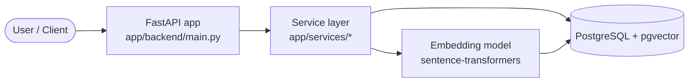

<!-- Structured template. The diagram skeleton and section headings are provided;
     the explanatory prose is the learner's to write. Do NOT auto-fill prose. -->

# System Architecture

## 1. High-level overview

> **TODO(learner):** Describe the request lifecycle in your own words.

## 2. Components

| Component | Location | Responsibility |
| --------- | -------- | -------------- |
| API layer | `app/api/` |  |
| Service layer | `app/services/` |  |
| Data models | `app/db/models.py` |  |
| DBMS simulators | `dbms_internals/` |  |
| Migrations | `alembic/` |  |

> **TODO(learner):** Fill in the responsibility column.

## 3. Data flow: semantic search

> **TODO(learner):** Trace a semantic query from request to ranked results.

## 4. Technology choices

> **TODO(learner):** Justify PostgreSQL, pgvector, FastAPI, and the embedding model.

## 5. Trade-offs and future work

> **TODO(learner):** Note limitations and what you would change.
