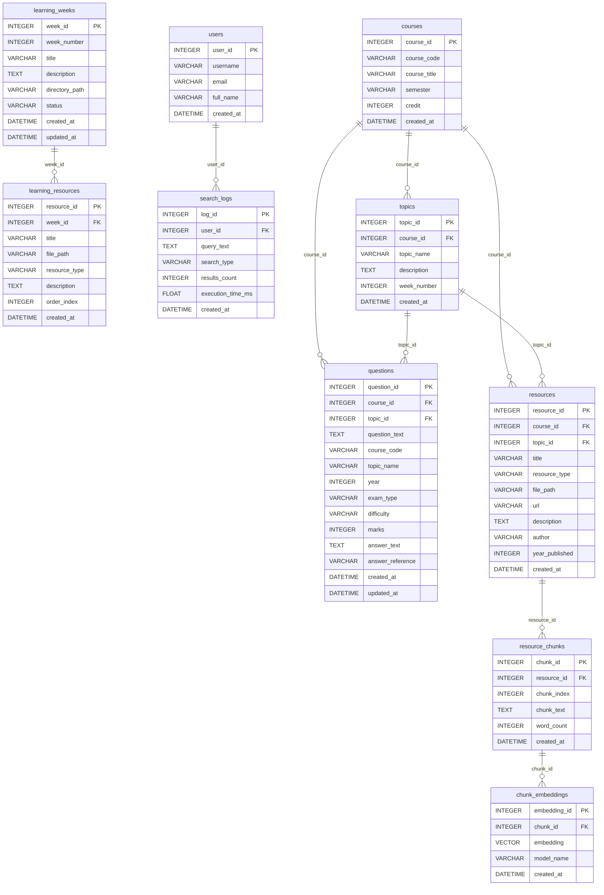

<!-- ER skeleton auto-generated from app/db/models.py. The diagram is provided;
     the prose explanation of design choices is the learner's to write. -->

# CourseDB-AI ER Design

Entity-relationship diagram derived from the SQLAlchemy models. Relationship
lines follow the foreign keys defined in `app/db/models.py`.

> **TODO(learner):** Explain the design: entity choices, cardinalities,
> intentional denormalization (e.g. `questions.course_code`), and trade-offs.
