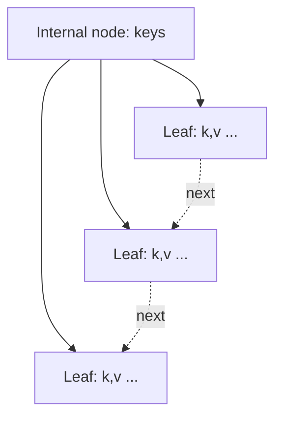

<!-- Template only. Diagrams OK. The conceptual explanation is the learner's. -->

# B+ Tree Explanation

Reference implementation: `dbms_internals/bplus_tree/bplus_tree.py`.

## Structure diagram

> **TODO(learner):** Replace with a diagram matching your chosen order/fan-out.

## Key properties to explain

| Property | Your explanation |
| -------- | ---------------- |
| Order / fan-out |  |
| Leaf vs internal node |  |
| Why all data lives in leaves |  |
| Leaf-level linked list (range scans) |  |
| Height bound `O(log_m n)` |  |

## Operations

> **TODO(learner):** Walk through insert (with split), search, and range query
> using the simulator's output.

## Self-check questions

1. Why is a B+ tree preferred over a binary search tree on disk?
2. What triggers a node split, and how does the median propagate?
3. How does the height bound relate to the number of disk reads?

> **Notes:**
