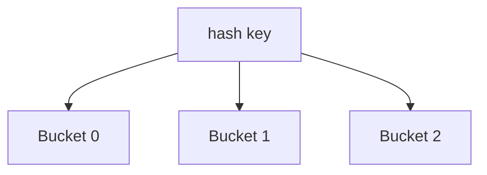

<!-- Template only. Diagrams OK. The conceptual explanation is the learner's. -->

# Hash Index Explanation

Reference implementation: `dbms_internals/hash_index/hash_index.py`.

## Structure diagram

> **TODO(learner):** Adapt the diagram to the scheme you describe (static vs
> extendible vs linear hashing).

## Key concepts to explain

| Concept | Your explanation |
| ------- | ---------------- |
| Hash function role |  |
| Bucket / collision handling |  |
| Load factor & rehashing |  |
| Static vs dynamic hashing |  |

## When to use a hash index vs B+ tree

> **TODO(learner):** Compare equality vs range lookups.

## Self-check questions

1. Why can't a hash index answer range queries efficiently?
2. What is a collision and how does this implementation resolve it?
3. When does the index resize, and what is the cost?

> **Notes:**
